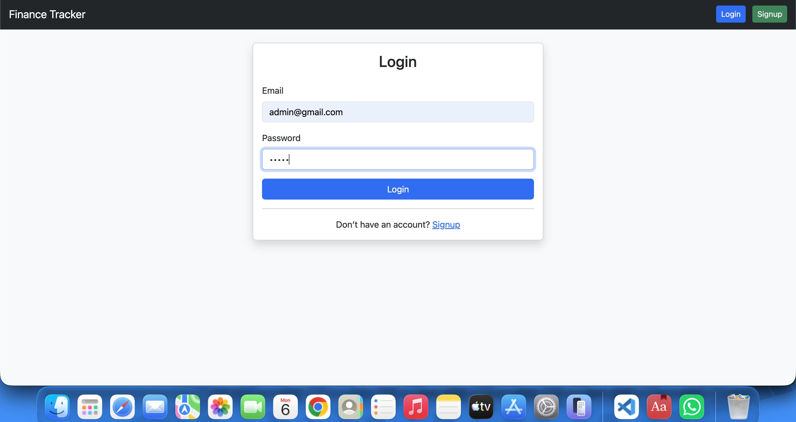
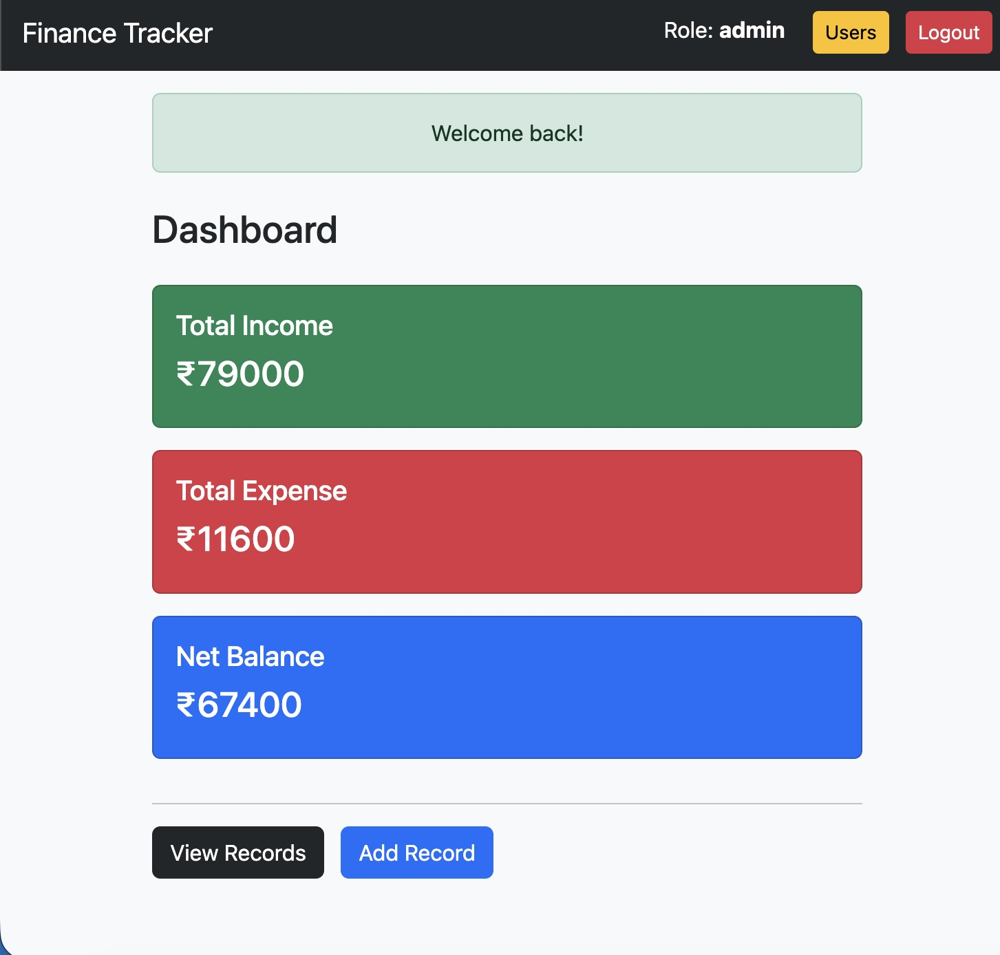
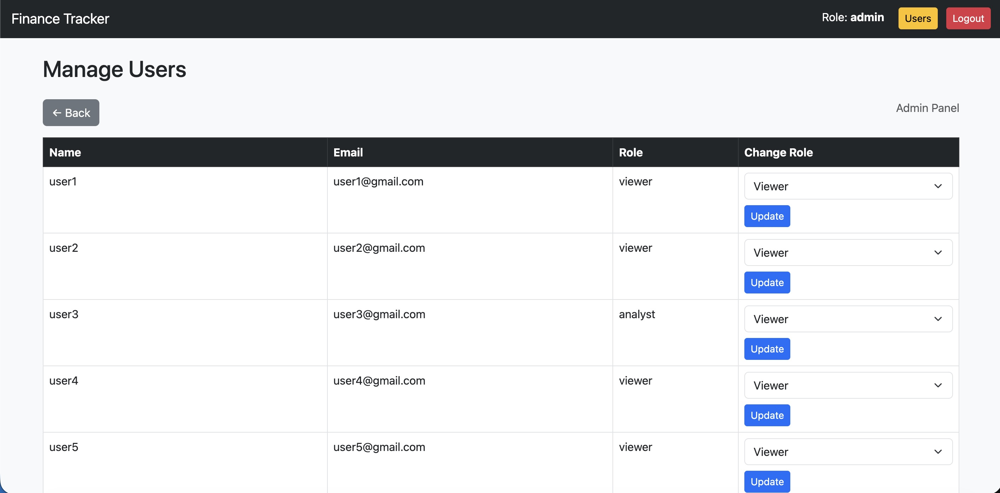
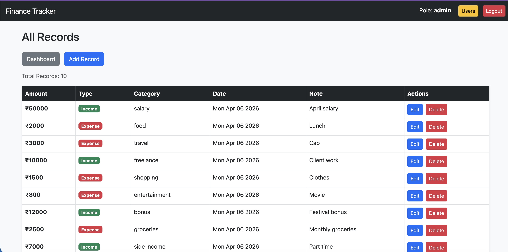

# 💰 Finance Tracker Backend

A role-based backend system for managing financial records, users, and dashboard analytics. This project demonstrates backend architecture, API design, access control, and data handling as part of a backend development assignment.

---

# 💰 Finance Tracker Backend

## 🚀 Live Demo
https://finance-tracker-30bc.onrender.com

---

## 🔑 Demo Credentials (For Testing)

You can use the following credentials to explore different roles in the system:

- You can make new users also by signing up(new user will be a viewer to upgrade it you need to login to admin then edit role of that user):

### 👑 Admin

- **Email:** admin@gmail.com  
- **Password:** admin  

👉 Access:
- Manage users
- Create / update / delete records
- Assign roles (Viewer / Analyst)

---

### 📊 Analyst

- **Email:** user3@gmail.com  
- **Password:** user3

👉 Access:
- View financial records
- Access dashboard insights

---

### 👁️ Viewer

- **Email:** user1@gmail.com  
- **Password:** user1

👉 Access:
- Read-only access to dashboard data

---

## 🧭 How to Use the Application

1. Open the live link:
   👉 https://finance-tracker-30bc.onrender.com  

2. Login using above credentials  
3. Explore features based on role  

---

## 📸 Screenshots

<p align="center">
  
</p>

<p align="center">
  
</p>

<p align="center">
  
</p>

<p align="center">
  
</p>

---

## ⚠️ Assumptions

* The system includes three roles: **Admin, Analyst, and Viewer**
* Only **Admin** can manage users and financial records
* **Analyst** and **Viewer** have limited access based on their roles
* Admin can not give admin to other there is only 1 admin to make multiple admin we have to change in DB
* Authentication is handled using session-based login


## 📌 Objective

This project was developed to demonstrate backend engineering skills including:

* API design and structure
* Role-based access control
* Data modeling and persistence
* Business logic implementation
* Validation and error handling

---

## 🧠 Features

### 👤 User & Role Management

* Create and manage users
* Assign roles: **Admin, Analyst, Viewer**
* Role-based permissions:

  * **Viewer** → Can view data
  * **Analyst** → Can view records & insights
  * **Admin** → Full access (users + records)

---

### 💵 Financial Records Management

* Create, read, update, delete (CRUD) records
* Fields:

  * Amount
  * Type (Income / Expense)
  * Category
  * Date
  * Notes
* Filtering support (basic)

---

### 📊 Dashboard Features

* Total Income
* Total Expenses
* Net Balance
* Category-wise insights
* Recent activity tracking

---

### 🔐 Access Control

* Implemented using middleware
* Role-based restrictions enforced
* Unauthorized actions are blocked

---

### ✅ Validation & Error Handling

* Input validation implemented
* Flash messages for feedback
* Proper handling of invalid requests

---

### 💾 Data Persistence

* MongoDB Atlas (cloud database)
* Mongoose for schema modeling

---

## 🛠️ Tech Stack

* **Backend:** Node.js, Express.js
* **Database:** MongoDB Atlas
* **Authentication:** Passport.js (Local Strategy)
* **Templating:** EJS
* **Session Management:** express-session
* **Validation:** Custom middleware

---

## ⚙️ Setup Instructions

### 1️⃣ Clone the repository

```bash
git clone https://github.com/Muneesh1929/finance-tracker.git
cd finance-tracker
```

### 2️⃣ Install dependencies

```bash
npm install
```

### 3️⃣ Create `.env` file

```env
MONGO_URL=your_mongodb_connection_string
SESSION_SECRET=your_secret_key
PORT=3000
```

### 4️⃣ Run the server

```bash
node server.js
```

---

## 🔗 API Routes (Sample)

### User Routes

* `/api/signup`
* `/api/login`
* `/api/users`

### Record Routes

* `/api/records`
* `/api/records/new`
* `/api/records/:id/edit`

---

## 🔒 Role-Based Access Control

| Role    | Permissions                 |
| ------- | --------------------------- |
| Viewer  | Read-only access            |
| Analyst | View records & insights     |
| Admin   | Full CRUD + user management |

---

## ⚠️ Assumptions

* Admin is responsible for managing users and records
* UI restricts admin role assignment for simplicity
* Authentication is session-based (not token-based)

---

## ✨ Improvements (Future Scope)

* JWT-based authentication
* Pagination & advanced filtering
* API documentation (Swagger)
* Unit & integration testing
* Better UI/UX
* Super Admin role for enhanced security

---

## 📊 Evaluation Mapping

This project fulfills the assignment requirements:

* ✔ Backend design and structure
* ✔ Role-based access control
* ✔ CRUD operations
* ✔ Dashboard aggregation logic
* ✔ Validation and error handling
* ✔ Clean and maintainable code

---

## 👨‍💻 Author

**Muneesh Sharma**

* M.Tech Data Science, LPU
* Backend Developer (Node.js, MongoDB)

🔗 GitHub: https://github.com/Muneesh1929

---

## ⭐ Conclusion

This project demonstrates a structured approach to backend development, focusing on scalability, clarity, and maintainability while implementing real-world concepts such as role-based access control and financial data management.
